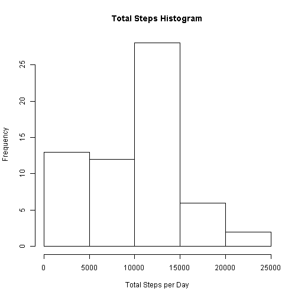
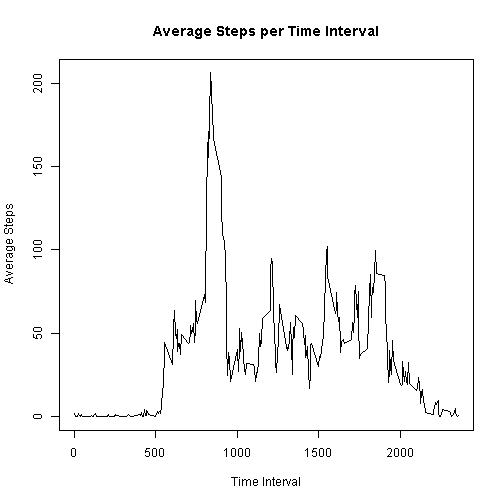

## Loading and preprocessing the data

First, we shall start with unzipping the data and loading it into the dataframe labeled "data"


```r
suppressWarnings(library(dplyr))

unzip("activity.zip")

data <- read.csv("activity.csv")
```

## What is mean total number of steps taken per day?


```r
data_1 <- select(data, date, steps) %>%
	group_by(date) %>%
	summarise(	total_steps = sum(steps, na.rm = TRUE))

hist(data_1$total_steps, main = "Total Steps Histogram", xlab = "Total Steps per Day")
```

 

```r
mean(data_1$total_steps)
```

```
## [1] 9354.23
```

```r
median(data_1$total_steps)
```

```
## [1] 10395
```

## What is the average daily activity pattern?


```r
data_2 <- select(data, interval, steps) %>%
	group_by(interval) %>%
	summarise(	avg_steps = mean(steps, na.rm = TRUE))

plot(data_2, type = "l", main = "Average Steps per Time Interval", xlab = "Time Interval",
	ylab = "Average Steps")
```

 

```r
filter(data_2, avg_steps == max(data_2$avg_steps))
```

```
## Source: local data frame [1 x 2]
## 
##   interval avg_steps
## 1      835  206.1698
```

## Imputing missing values

### Number of incomplete cases

```r
nrow(data[!complete.cases(data),])
```

```
## [1] 2304
```

The incomplete data will be replaced with the average number of steps for that time interval.


## Are there differences in activity patterns between weekdays and weekends?
